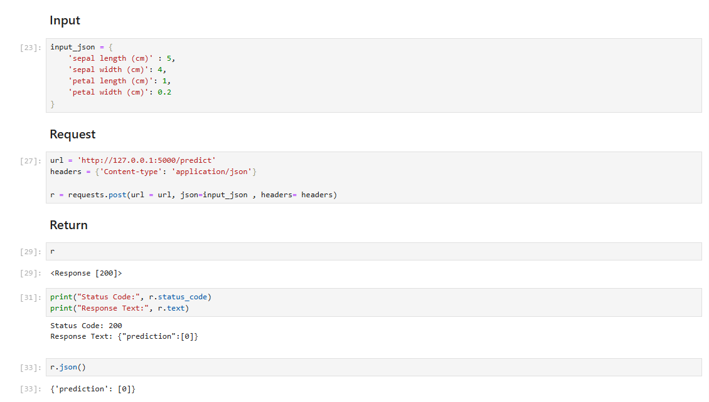

# Projeto de API para consumo de ML


### Bibliotecas utilizadas

```
    pip install joblib

    pip install flask

    pip install jsonify
```
 
### Fluxo do Projeto

- Construcao do Modelo 
    - Realizada no JupyterNotebook

- Salvar Modelo
    - Após feita as validacoes o modelo foi salvo em .pkl

- Criacao de API
    - Feito no Vscode com a biblioteca flask, o código vai consumuir os dados do .pkl

- Utilizando API
    - Executei a API no diretorio do arquivo .py `python API.py`
    

    - Criei um segundo arquivo jupyter notebook que vai consumir a API

    